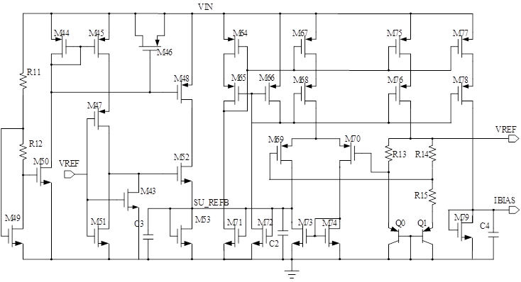

# 更新说明
***v0.1:***
- 完成了该电路原理的大致说明

- 完成了电路中带隙基准部分中关于正温度系数和负温度系数的说明

***v0.9:***

- 完成了所有电路的原理的大概阐述
- 对一些设计原理的公式进行了简单的推导

# 集成电路课程设计

## 带隙电压基准电路设计

## 原理分析

该电路用于实现一个稳定的基准源，要求有三点：

- 基准源电压不随温度变化而有较大波动

- 基准源电压不随给定的电源波动而有较大波动

- 基准源电压不随工艺影响而有较大的波动

带隙基准：低温度系数，***这里的电压具有类似硅材料的带隙电压的特点，即具有与电源电压和温度无关的特性。*** 实现方式是通过将两个具有相反温度系数的电压组合得到零温度系数的电压。
该电路主要由四部分组成：

-  温度补偿部分
-  放大器部分
- 启动电路部分
- 偏置电路部分

### 温度补偿部分

带隙基准电路要实现与温度无关的特性，因此，问题重点在于得到一个温度系数为零的参考电压。而实现方法是通过将一个负温度系数的电压和一个正温度系数的电压通过一定的比例整合起来，从而实现零温度系数。
$$
V_{R E F}=\alpha_{1} V_{1}+\alpha_{2} V_{2}, \quad \text { 且 } \alpha_{1} \frac{\partial V_{1}}{\partial T}+\alpha_{2} \frac{\partial V_{2}}{\partial T}=0 。
$$

#### 负温度系数的实现

双极性晶体管的基极和发射极电压具有负温度系数，且该温度系数本身不是固定值，会随着温度变化而变化：
$$
\frac{\partial V_{B E}}{\partial T}=\frac{V_{B E}-(4+m) V_{T}-E_{g} / q}{T}
$$

#### 正温度系数的实现

两个双极性晶体管在不同的饱和电流下，基极和发射极之间的电压也不同，其差值与绝对温度有关：
$$
\Delta V_{B E}=V_{B E 1}-V_{B E 2}=V_{T} \ln \frac{I}{I_{S}}-V_{T} \ln \frac{I}{n I_{S}}=V_{T} \ln \mathrm{n}
$$

$$
\frac{{\Delta \partial V_{B E}}}{\partial T}=\frac{V_{T}}{T} \ln \mathrm{n}
$$

通过正温度系数和负温度系数的叠加可以实现整个电路的零温度系数

#### 零温度系数的实现

有：

$$
V_{REF}=\alpha_{1} V_{BE}+\alpha_{2} (V_{T} \ln n)
$$

要实现零温度系数，要求

$$
\frac{\partial V_{REF}}{\partial T}=0
$$
同时又有
$$
\frac{\partial V_{BE}}{\partial T} \approx -1.5mV/^\circ K
$$
而且

$$
\frac{\partial V_{T}}{\partial T}\approx +0.087mV/^\circ K
$$

令$ \alpha_{1}=1 $，则$\alpha_{2}=17.2$，同时零温度系数的基准电压可以求得：
$$
V_{REF}\approx V_{BE}+17.2V_{T}
\approx 1.25V
$$
### 放大器部分

这是本设计中的放大器部分：

通过引入运算放大器，使得运放的两个输入端的电压近似相等，从而在$R_{3}$上的电压为两个三极管的基极－发射极之差$\Delta V_{BE}$为：
$$
\Delta V_{BE}=V_{T} \ln n
$$
最后可以得到输出电压为：
$$
V_{out}=V_{BE2}+{V_{T} \ln n}(1+\frac{R_{2}}{R_{3}})
$$
为了实现零温度系数，必须使得$(1+\frac{R_{1}}{R_{2}}) \ln n \approx 17.2$，选择合适的n的值和$R_1/R_2$的值。值得一提的是，这里的n指代的两个晶体管的数目的比例，但是，可以选择利用两个晶体管结面积的大小的比例来替代。

### 偏置电路部分

如上图所示，红框所标注的电路部分为偏置电路部分。在上图中，只有当SU_REFB点的电压为高电平时，MOS管M71和M72导通，然后M66，M65，M64，M67，M68，M75，M76，M77，M78导通，形成电流镜提供偏置电流。

### 启动电路部分

在上述偏置电路中，偏置电路除了正常的工作状态之外，还存在一种零电流状态，也即是在偏置电路中，所有晶体管传输的电流大小为零，此时，所有晶体管处于关闭状态。因此，该电路可能稳定在两种不同的状态中的一种，而当稳定在零电流状态时，电路是无法正常工作的，所以，启动电路就显得很有必要。启动电路可以在电源刚上电时，在电路中产生电流，从而使得电路状态确定在正常的工作状态。

在本电路中，启动电路为以下部分：

当电源上电时，mos管M44、M45、M49、M50形成电流镜，其中，M49与M50产生参考电流，当电路启动时，VREF为低电平，M43关闭，M52导通，点SU_REFB上有电压产生。偏置电路进入正常工作状态，最后在VREF输出高电平，M43导通，M52截止，此时启动电路不再对电路工作状态产生影响。这样，就确保了电路在上电时进入正常的工作状态。
